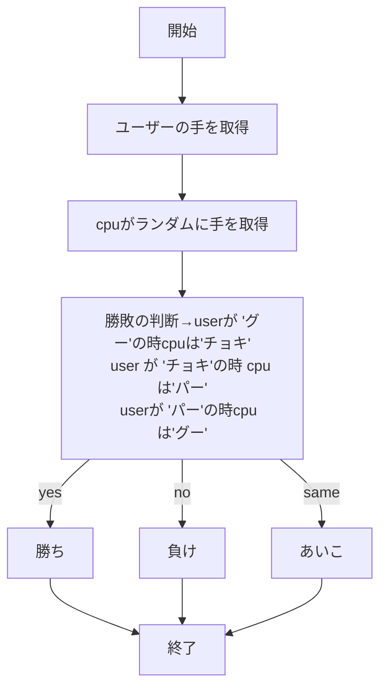
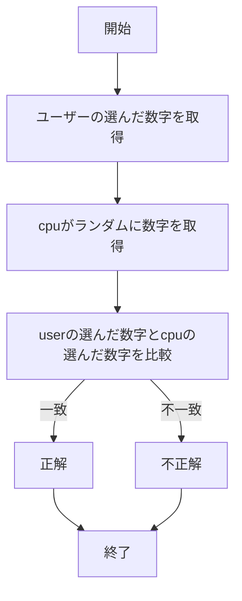
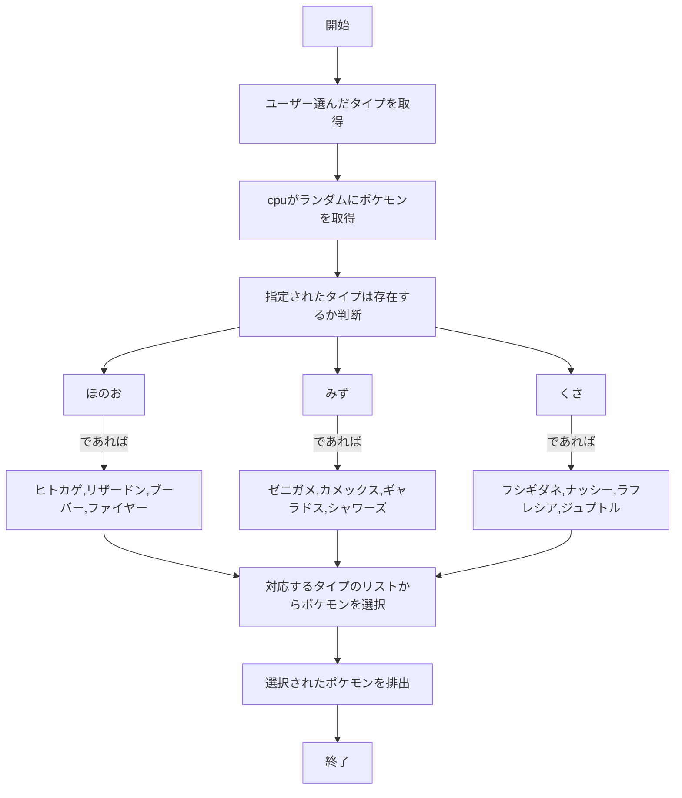

# webpro_06
2024/11/12
# #このプログラムについて
# #ファイル一覧
ファイル名 | 説明 
-|-|
app5.js | プログラム本体
public/janken.html | じゃんけんの開始画面
public/guess.html | 数字当てゲームの開始画面
public/pokemon.html | ポケモンガチャの開始画面
janken.ejs | プログラム本体
guess.ejs |プログラム本体
pokemon.ejs |プログラム本体
show.ejs |プログラム本体
luck.ejs |プログラム本体
```javascript

```
## app5.js

### hello1及びhello2について
1. app5.jsを起動する
1. webブラウザでlocalhost8080/showにアクセスする
1. メッセージを変数として，ejsに送る
1. 画面に"hello world"と"Bon jour"が表示される．
#### hello1とhello2の違い
1. hello2はhello1とほぼ同じ機能であるが，異なる点として，hello1は変数にメッセージ内容を代入し，ejsに送るが，hello2ではメッセージを直接ejsに送る．

### iconについて
1. app5.jsを起動する
1. webブラウザでlocalhost8080/iconにアクセスする
1. アイコンが表示される．(今回はappleロゴ)

### luck
1. app5.jsを起動する
1. webブラウザでlocalhost8080/luckにアクセスする
1. 2つの乱数が生成され，「大吉」「中吉」のどちらかが表示される

### jankenについて
1.　app5.jsを起動する
1. Webブラウザでlocalhost:8080/public/janken.htmlにアクセスする
1. 自分の手を選択する
1. cpuの出す手と勝負し，勝敗が表示される

### guessについて
1. app5.jsを起動する
1. Webブラウザでlocalhost:8080/public/guess.htmlにアクセスする
1. 自分の選んだ数字を入力し送信する
1. 自分の選んだ数字とcpuが選んだ数字が一致するかを判定し，正解不正解を表示

### pokemonについて
1. app5.jsを起動する
1. Webブラウザでlocalhost:8080/public/pokemon.htmlにアクセスする
1. 自分の選んだタイプを選択する
1. Userによって選ばれたタイプの中からランダムにポケモンを排出する


